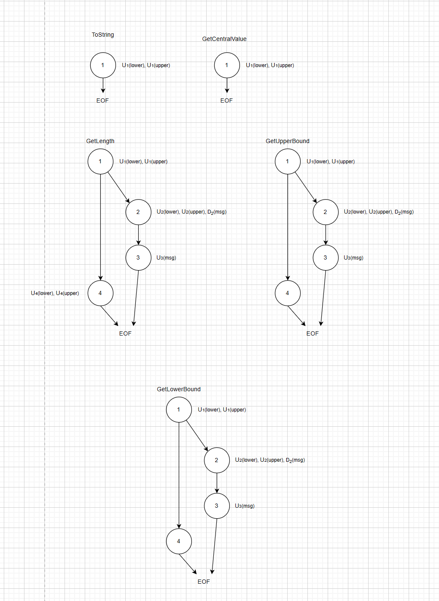
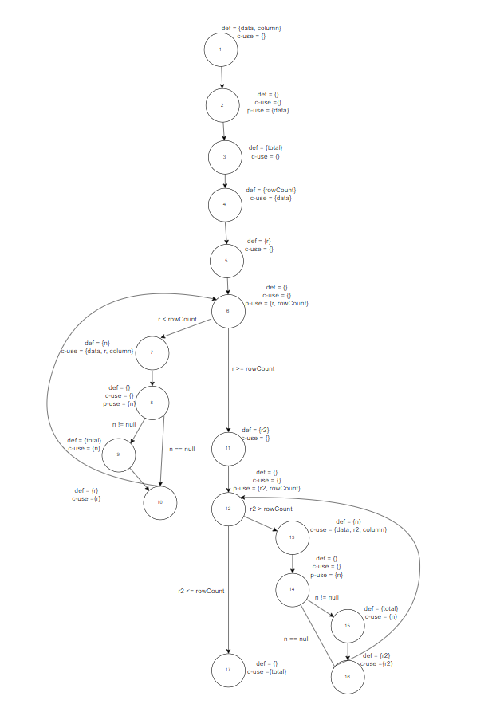
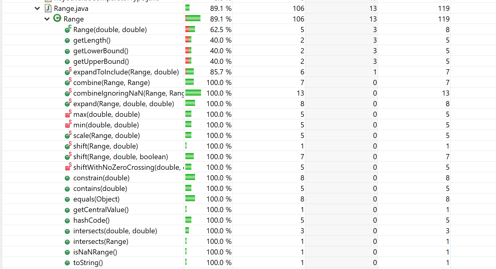
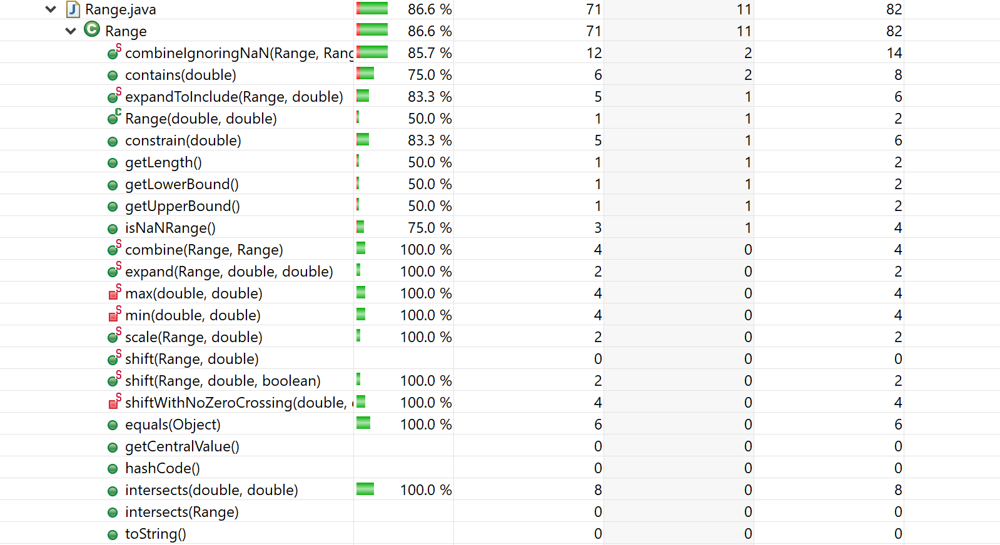
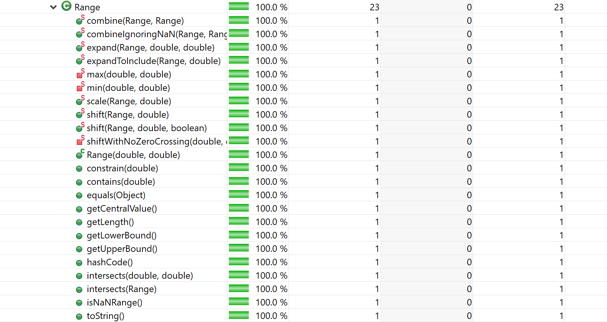
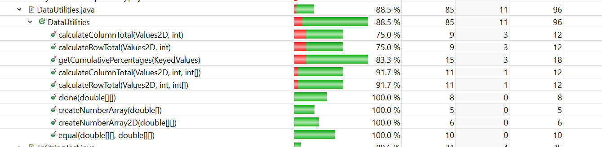
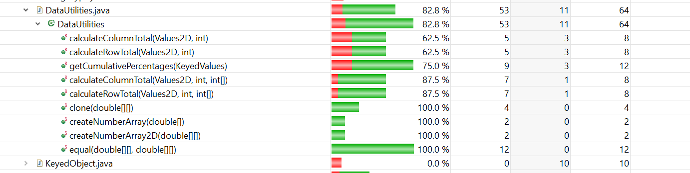
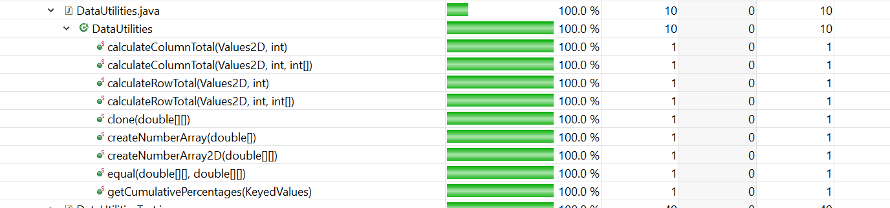

**SENG 438 - Software Testing, Reliability, and Quality**

**Lab. Report #3 – Code Coverage, Adequacy Criteria and Test Case Correlation**

| Group 23:         |          |
| ----------------- | -------- |
| Nicole Heather    |          |
| Nora Mellik        |          |
| Nelson Thompson   |          |
| Jennifer Jay      |          |

(Note that some labs require individual reports while others require one report
for each group. Please see each lab document for details.)

# 1 Introduction

Software testing is a process that takes a serious amount of time to plan and schedule, as in order to enusre that your test cases and suites are actually effective developers and engineers must carefully examine their existing code. In contrary to black-box testing, white-box testing allows a developer access to the code and documentation. This means that intead of looking at a program from an outisde perspective, we actually know the logic and paths that a program has, which also means that we are able to expand on the kind of test cases we can create. Now, us testers must consider the coverage of the tests, whether they are able to account for every possible statement, condition, and branch that a program will make. 

# 2 Manual data-flow coverage calculations for X and Y methods

Range:
    Due to the limted logic and constructor throwing exceptions when lower is larger than upper in the Range class the possiblity of full data-flow coverage is very limited. This results in in branches not being taken, as without setters for upper and lower or a change to the constructor the branches within our 5 fucntions will always be missed. There is also somthing to note as the definitions for all these functions will always be 0, as these values are made and assigned in the constructor wich is not a part of the functions we are testing. In order to make clear the method used for manual calculations, assume we make nodes for each line of code in each function starting at 1. Note that we went through all of our functions as they are simple and most to not contain def use pairs or paths.

Data-Flow Graphs for Range:

| Value | Function          |   defs   |   uses                 |   du-paths          |   du-pairs                |  Covered          |
|-------|-------------------|----------|------------------------|---------------------|---------------------------|-------------------|
| lower | ToString()        |  None    | use(1)                 | None                | None                      | NA                |
|       | GetUpperBound()   |  None    | use(1), use(2)         | None                | None                      | NA                |
|       | GetLowerBound()   |  None    | use(1), use(2), use(3) | None                | None                      | NA                |
|       | GetCentralValue() |  None    | use(1)                 | None                | None                      | NA                |
|       | GetLength()       |  None    | use(1), use(2), use(3) | None                | None                      | NA                |
| upper | ToString()        |  None    | use(1)                 | None                | None                      | NA                | 
|       | GetUpperBound()   |  None    | use(1), use(2), use(3) | None                | None                      | NA                |
|       | GetLowerBound()   |  None    | use(1), use(2)         | None                | None                      | NA                |
|       | GetCentralValue() |  None    | use(1)                 | None                | None                      | NA                |
|       | GetLength()       |  None    | use(1), use(2), use(3) | None                | None                      | NA                |
| msg   | ToString()        |  None    | None                   | None                | None                      | NA                |
|       | GetUpperBound()   |  def(2)  | use(3)                 | du(2, msg) = [2, 3] | du(2, 3, msg) = [1, 2, 3] | False, False      |
|       | GetLowerBound()   |  def(2)  | use(3)                 | du(2, msg) = [2, 3] | du(2, 3, msg) = [1, 2, 3] | False, False      | 
|       | GetCentralValue() |  None    | None                   | None                | None                      | NA                |
|       | GetLength()       |  def(2)  | use(3)                 | du(2, msg) = [2, 3] | du(2, 3, msg) = [1, 2, 3] | False, False      |

For this table, in GetUpperBound, GetLowerBound and GetLength, use(2) is unreachable, and technically not covered.

data-flow coverage with the inclusion of the unreachable code:
- True / Total = 0%

data-flow coverage without the inclusion of the unreachable code:
- NA due to lack of paths for lower and upper, however plase make note that the uses for lower and upper where already covered in the previous assignment.

DataUtilities:

Data-Flow Graph:

the def-use sets per statement for DataUtilities.calculateColumnTotal:
defs:  
def(1) = {data, column}
def(3) = {total}
def(4) = {rowCount}
def(5) = {r}
def(7) = {n}
def(9) = {total}
def(10) = {r}
def(11) = {r2}
def(13) = {n}
def(15) = {total}
def(16) = {r2}
uses:
use(2) = {data}
use(4) = {data}
use(6) = {r, rowCount}
use(7) = {data, r, column}
use(8) = {n}
use(9) = {n, total}
use(10) = {r}
use(12) = {r2, rowCount}
use(13) = {data, r2, column}
use(14) = {n}
use(15) = {n, total}
use(16) = {r2}
use(17) = {total}

DU-pairs: 
data: {[1, 2], [1, 4], [1, 7], [1, 13]}
column: {[1, 7], [1, 13]}
total: {[3, 9], [3, 15], [9, 9], [9, 15], [15, 15], [3, 17], [9, 17], [15, 17]}
rowCount: {[4, 6], [4, 12]}
r: {[5, 6], [5, 7], [5, 10], [10, 10], [10, 7]}
n: {[7, 8], [7, 9], [13, 14], [13, 15]}
r2: {[11, 12], [11, 13], [11, 16], [16, 16], [16, 12]}

Show which pairs are covered for each test case:
calculateColumnTotalForTwoValues(): 
   data: {[1,2], [1,4], [1,7]}
   column: {[1, 7]}
   r: {[5, 6], [5, 7], [5, 10], [10,10], [10, 7]} 
   r2: {[11, 12]}
   n: {[7, 8], [7, 9]}
   total: {[3, 9], [9, 9], [3, 17], [9, 17]}
calculateColumnTotalForInvalidValues():
   data: {[1,2], [1,4]}
   r: {[5, 6]}
   r2: {[11, 12]}
   total: {[3, 17]}
calculateColumnTotalForThreeValues():
   data: {[1,2], [1,4], [1,7]}
   column: {[1, 7]}
   r: {[5, 6], [5, 7], [5, 10], [10,10], [10, 7]} 
   r2: {[11, 12]}
   n: {[7, 8], [7, 9]}
   total: {[3, 9], [9, 9], [3, 17], [9, 17]}
calculateColumnTotalWithZeroInput():
   data: {[1,2], [1,4]}
   r: {[5, 6]}
   r2: {[11, 12]}
   total: {[3, 17]}
calculateColumnTotalWithMultipleColumns():
   data: {[1,2], [1,4], [1,7]}
   column: {[1, 7]}
   r: {[5, 6], [5, 7], [5, 10], [10,10], [10, 7]} 
   r2: {[11, 12]}
   n: {[7, 8], [7, 9]}
   total: {[3, 9], [9, 9], [3, 17], [9, 17]}
calculateColumnTotalWithMultipleColumns():
   data: {[1,2], [1,4], [1,7]}
   column: {[1, 7]}
   r: {[5, 6], [5, 7], [5, 10], [10,10], [10, 7]} 
   r2: {[11, 12]}
   n: {[7, 8], [7, 9]}
   total: {[3, 9], [9, 9], [3, 17], [9, 17]}
calculateColumnTotalWithMissingValue():
   data: {[1,2], [1,4], [1,7]}
   column: {[1, 7]}
   r: {[5, 6], [5, 7], [5, 10], [10,10], [10, 7]} 
   r2: {[11, 12]}
   n: {[7, 8], [7, 9]}
   total: {[3, 9], [9, 9], [3, 17], [9, 17]}
calculateColumnTotalWithOneColumn():
   data: {[1,2], [1,4], [1,7]}
   column: {[1, 7]}
   r: {[5, 6], [5, 7], [5, 10], [10,10], [10, 7]} 
   r2: {[11, 12]}
   n: {[7, 8], [7, 9]}
   total: {[3, 9], [9, 9], [3, 17], [9, 17]}

DU-Pair Coverage:
(16/30) * 100% = 53%

# 3 A detailed description of the testing strategy for the new unit test

Range:
Functions being tested:
| Methods                                                                  | Requirements                                      |
|--------------------------------------------------------------------------|---------------------------------------------------|
| contains(double value) : boolean                                         | Returns true if value is in range                 |(Nicole)
| intersects(double b0, double b1) : boolean                               | Returns true if one range intersects with another |(Nelson)
| intersects(Range range) : boolean                                        | Returns true if one range intersects with another |(Nicole)
| combineIgnoringNaN(Range range1, Range range2) : static Range            | Combines ranges including NaN values              |(Nelson)
| expandToInclude(Range range, double value) : static Range                | Epands a range to include a value                 |(Nelson)
| expand(Range range,double lowerMargin,double upperMargin) : static Range | Expands a range to specifies values               |(Nelson)
| shift(Range base, double delta) : static Range                           | shifts the range to a specified value             |(Nicole)
| shift(Range base, double delta,boolean allowZeroCrossing) : static Range | shifts the range to a specified value             |(Nelson)
| shiftWithNoZeroCrossing(double value, double delta) | static Range       | shifts a range with a check for crossing          |(Nelson)
| equals(Object obj) : boolean                                             | Returns true if an object equals another          |(Nicole)
| hashCode() : int                                                         | Returns a hash code                               |(Nicole)
| scale(Range range, double value) : static Range                          | Scales range values by a value                    |(Nelson)
| combine(Range range1, Range range2) : static Range                       | Combines two ranges                               |(Nicole)
| constrain(double value) : double                                         | returns the value closest to a specified value    |(Nicole)

Test Objectives:
Becasue our coverage is limited by the source code, we decided to test new methods. Looking back at the functions chosen in assignment 2, we were unable to expand on the coverage for anything due to both their simplicity and the iniablility to access certiain branches of code. So, the objective of these new tests are to cover as much of class Range as possible, while still making them relevant to the requirements that they must fuffill.

Limitatons and Concerns: 
There is not much to improve on with the data-flow coverage with the range classes without changing the source code to allow for cases where lower is larger than upper. This is not just an issue with ipper and lower though, as some return and if statement logic also does not allow for many different kinds of coverage.

DataUtilities:
Functions being tested:
| Methods                                            | Requirements                                                           |
|----------------------------------------------------|------------------------------------------------------------------------|
| calculateColumnTotal() : static double             | Returns the sum of the values in one column of the supplied data table |
| calculateRowTotal() : static double                | Returns the sum of the values in one row of the supplied data table    |
| getCumulativePercentages() : static KeyedValues    | Returns a instance that contains the cumulative percentage values      | 
| equal(double[][] a, double[][] b) : static boolean | Returns true if arrays are equal, fasle if not                         |
| clone(double[][] source) : static double[][]       | Returns a clone of the specified array                                 | 

Testing Outline:
In the original DataUtilities class, the methods that contained red (and therefore had not been covered by the original tests from Assignment 2) were equal(), clone(), both of the calculateColumnTotal(), both of the calculateRowTotal(), and getCumulativePercentages(). The initial starting percentages were 48.7% statement coverage, 32.8% branch coverage, and 60% method coverage. The tests will be developed by referencing which tests are needed to fully cover the DataUtilities class. Part of the plan is also changing the mocking to use the relevant objects, meaning using DataKeyedValues2D and DataKeyedValues. Nora and Jen will work on implementing the new tests to fulfill the needed coverage percentages, which are found using EclEmma. The splitting of the classes/tasks is as follows:

equal() - Jen,
clone() - Jen,
calculateColumnTotal() - Nora,
calculateRowTotal() - Nora,
getCumulativePercentages() - Jen,
Change mocking - Nora,

Limitations and Concerns:
It is impossible to reach full statement and branch coverage because their are multiple branches we cannot reach without changing the source code. In several for loops, the iterator variable was declared as zero, and required the count of the row, column or item count to be less than zero which is impossible. Similarly, there is an if statement that required the column count to be less than zero. In another case, the variable "total" was initialized to zero, prior to an if statement that required total to be greater than zero.

White-Box Testing:
Unlike in assignment 2, we have been given full access to the source code of the SUT. This allows us to take a look into the behavioural functionality of the code, in which we must edit or add new test cases to ensure that we have as much coverage as possible. 

Test Criteria:
There is no specified exit or suspension criteria, the main goal of this lab is the planning and execution of JUnit testing.

Distribution:
| Group Member | Assigned Class | Other Group Work             |
|--------------|----------------|------------------------------|
| Nicole       | Range          | Report                       |
| Nelson       | Range          | Review and Quality Assurance |
| Jen          | DataUtilities  | Review and Quality Assurance |
| Nora         | DataUtilities  | Report                       |

Resource Planning:
- System Resources:
  | No.| Resources | Description                      |
  |----|-----------|----------------------------------|
  | 1. | Computer  | Needs to be able to run Eclipse  | 
  | 2. | Eclipse   | Needs correct developer suite    |
  | 3. | JUnit     | Need correct extensions          |
  | 4. | EclEmma   | Needs a coverage tool            |

- Human Resources:
  | No.| Resources       | Description                                                  |
  |----|-----------------|--------------------------------------------------------------|
  | 1. | Test Manager    | Manage and direct the testing design and execution           |
  | 2. | Test Writers    | Write and debug the creation of JUnit classes                |
  | 3. | Quality Assurer | Ensure the report, documentation and code meets requirements |
  | 4. | Report Writer   | Documents planning, design and answers lab questions         |

# 4 A high level description of five selected test cases you have designed using coverage information, and how they have increased code coverage

Range:
1. contains(double value): contains_DoesContain()
   - Coverage: Now with access to the source code and the ablility to test other methods, we saw clearly that we both failed to cover this method with its statements and branches, and as the functions we chose before did not have much logic we created a test class and multiple test cases.
   - Result: This specific test case is the first test case designed in order to provide some basic statement coverage, as it will cover multiple branches and statements right away from its basic execution. However there is the return statement that has branches that cannot be accessed as a result of its internal logic.
2. equals(Object obj): testInvalidObjectTypeForMethodEqual()
   - Coverage: Much like the previous methods that were not chosen to be tested we did not have any statement, branch, method or condition coverage.
   - Result: This test case is responsible for covering the branches where the passed object is not an instance of Range, and therefor we have covered the conditions, branches and statements present within it.
3. intersects(double d0, double d1): testIntersectsB0BiggerThanUpperAndB1isBiggerThanB0()
   - Coverage: Like before, we had not tested this method. This resulted in absolutley no coverage within any measure.
   - Result: By using this test we where able to cover both statement, method and branch coverage. 
4. hashCode(): testHashCode()
   - Coverage: The corresponding test class and test cases were made with the intention in adding new ways to cover previously uncovered methods, much like the hashCode function as it was not tested before.
   - Result: This is actually the only test in the class as the related function does not include any branches or conditions only a calculation of a hash code, however this still provides testing coverage in regards to statements.
5. expandToInclude: testNullRangeForMethodExpandToInclude()
   - Coverage: Finally, this method is still much like the other above. Untested and unused, we where missing any kind of coverages withing our previous suites.
   - Result: This test confirms that the first branch of the function is evaluated properly, this means that the corresponding statements, conditions and branches were also partly covered as a result of this test.

DataUtilities:
1. equal(): equalNullA()
   - Coverage: As we now had access to the source code, we could see the equal() method which was not mentioned in the documentation. This test was not covered at all in the original Assignment 2 code and thus contributed nothing to the original coverage percentage. This specific case tests the if (a == null) branch where the condition is true.
   - Result: This test was able to use assertFalse to make sure the if condition was entered and returned the expected value of (b == null) being false.
2. equal(): equalNullB()
   - Coverage: This test covers the case in equal() where the first condition, if (a==null) is false and the code continues running to the next condition, if (b == null). In this test case, it goes into the second branch and increases coverage by going to the next condition.
   - Result: This test was able to use assertFalse to make sure the second condition was entered and returned the expected value
3. equal(): equalBothNull:
   - Coverage: To increase coverage of the equal() method, creating a case where both a and b are null allows for further ondition testing of the equal() method.
   - Result: We compare the output to the assert present in the test case.
4. clone(): cloneWithNonNullSource()
   - Coverage: clone() is another method which had no previous tests for it. This test ensured coverage increased by increasing the number of methods tested in DataUtilities.
   - Result: This test checked when null values were present in the array. It used an assertEquals to ensure the output of the function was as expected.
5. calculateColumnTotal(): testCalculateRowTotalThreeArgsWithValidInput()
   - Coverage: Although our initial tests from assignment 2 applied the calculateRowTotal() tests based on black-box testing, there were still unknown elements of the DataUtilities class that were not covered, such as calculateRowTotal() with three parameters. This test increased coverage by accessing the previously unaccessed code lines.
   - Result: This used an assertEquals to ensure the output was as expected from the calculateRowTotal() with three parameters.
   - 
# 5 A detailed report of the coverage achieved of each class and method (a screen shot from the code cover results in green and red color would suffice)

Statement:

Branch:

Method:

DataUtilities:

Statement:

Branch:

Method:

# 6 Pros and Cons of coverage tools used and Metrics you report

The only coverage tools used was EclEmma, the metrics that we used from the tool only gave a calculation on the coverage as a whole. This meant that we had a simple and reliable tool at our disposal. We needed to take some more time to fully examine our codes coverage as the output from EclEmma is not very detailed until you got to the testcases themselves and take a look at the highlights on the the code. EclEmma also runs the entire application as a coverage test, which can result in needing to sift through outputs to find our classes.

The main kinds of metrics we used in order to caclulate our coverage where coverage percents based on the following categoreis; data-def, data-use, statement, branch, decision and method coverage. These were calculated manually with our own review of our code and with the EclEmma coverage tool. These metric provided an understanable way to analyze the coverage of our tests, as our code is not that complicated it is slightly easier to track the progess through methods.The only metric that was not entirely useful was the method coverage metric, as we know that we only have 5 functions to test.

# 7 A comparison on the advantages and disadvantages of requirements-based test generation and coverage-based test generation.

Requirement Based Testing:
This form of testing is a great tool for the output and functionality of a program. Its focus on the requirements of a system allows for a deep exploration on the correctness and on the unseen logic of a system. It its slightly more simple in its approach since there is only so much a programmer can do without access to code, this results in the manpower required being minimal if you are efficient with your time. Unlike coverage based testing, 

Coverage Based Testing: 
Coverage testing is more focuesed on the inner workings of the code, and how its behaviour effects the functionality of the program. Compared to black-box testing, it is far more exhasutive in how it tests code. This means that it takes much more time to come up with coverage calculations, graphs and new tests to ensure testing meet its standards. However unlike black-box testing, this method is far more adventageous un undertsaning the behaviour of a program, and catching any cases that back-box testing may have missed with its focus on requirements inseatad of inner logic. 

# 8 A discussion on how the team work/effort was divided and managed

The lab begain with the splitting up of classes to review and change. Becasue we are re-using code from the previous assignment, we decided to split members accoding to the tests they had worked on in assignment 2. This made the review and edit of the code far easier as each member was familiar with the suites they worked on. Due to the difference in coverage and logic complexity, the people who worked on the Range class took more responsibility with the lab report, documentation and scheduling in order to lessen the load on members that had to make more drastic change to thier code. 

# 9 Any difficulties encountered, challenges overcome, and lessons learned from performing the lab

A difficulty faced in this lab was the planning phase of the assignment. Becasue we are white-box testing we now have to consider a far more complex planning phase along with the review and consideration of the code we have previously made in assignment 2. Despite the issues faced, the biggest lesson we did learn was also how to plan and execute white-box and coverage testing. This lab allowed for a lot of experimentaton and exploration of how these can be done, even if you have code that is mostly covered, you can still find ways to make it better. 

However there was a massive issue with the source code we had to use, with so much code unreachible by the nature of the classes it feels like we where unable to fully deliver on what the assignment was asking for without having to make clear that this is an issue we cannot fix. This is rather frusturating as we know how to correct this, its just not possible in the code without causing errors.

# 10 Comments/feedback on the lab itself

Some of the instructions can be slightly confusing, it might be an improvement to provide a little more detail as to what is required with the manual calculations and planning documentation. White-box testing can be complex and confusing when in practice for the first time, so some more guidance on would provide more chances to learn this process. On the other hand, this lab was a educational look at how we can always improve the coverage and functionality of testing, especially when you have already testing a program using different methods. 

We think proper care should be taken to ensure that the source code we are using allows us to fully deliver on the requirments of this assignment. This may have been a simple oversight, but it was confusing to deal with considering the aim of this assignment. 
